# FP.5 : Performance Evaluation 1
TTC can be minus value when the velocity is under the zero. It means that the LiDAR and the preceding vehicle are getting further. 
And, when the distance between the LiDAR and the preceding vehicle is constant, TTC becomes inf. 
**Caution> After the 50th image, the distance between the LiDAR and the preceding vehicle may be constant (not moving.)**  
There is not serious problem on the result of LiDAR TTC EXCEPT the last frame.  
**On the last frame, there wes not any point on the preceding vehicle.** It seems like that the LiDAR is facing up slightly because of the accelerating.    
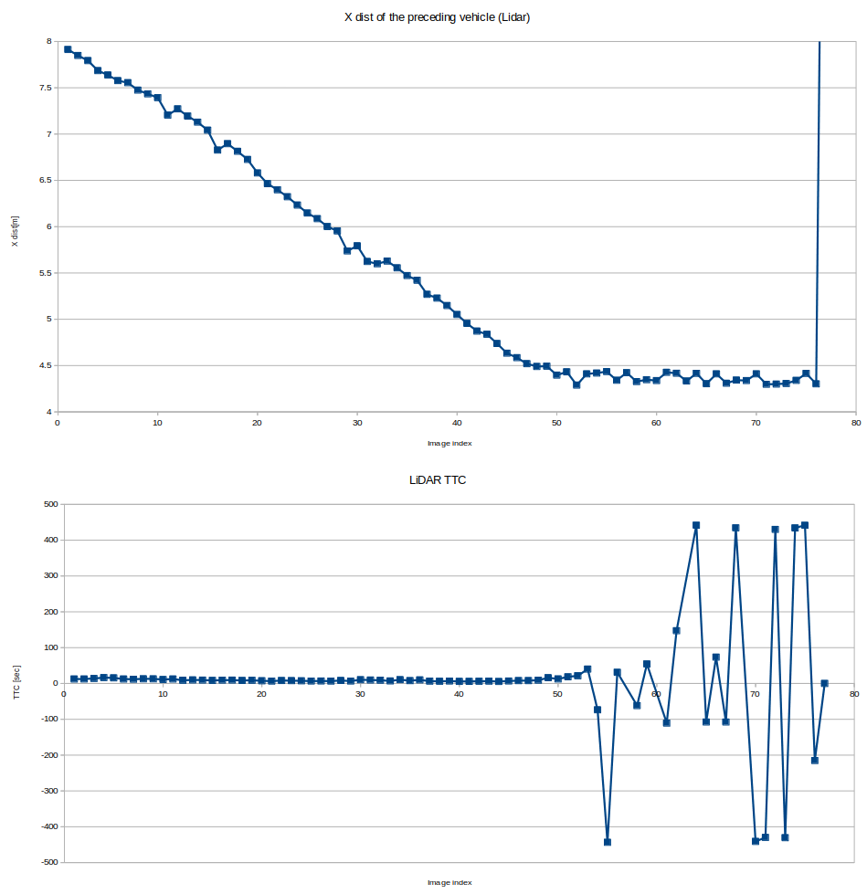  
 
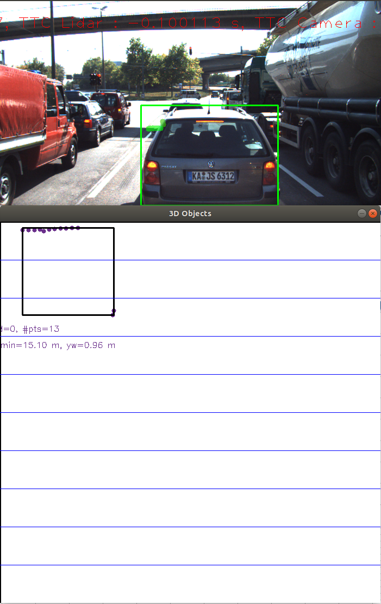   

### FP.5-1. Side Mirror 
When the preceding vehicle is close, the LiDAR measures the distance to objects reflected in the side mirror of the preceding vehicle.
Measured distance is totally different from the distance to the side mirror.  
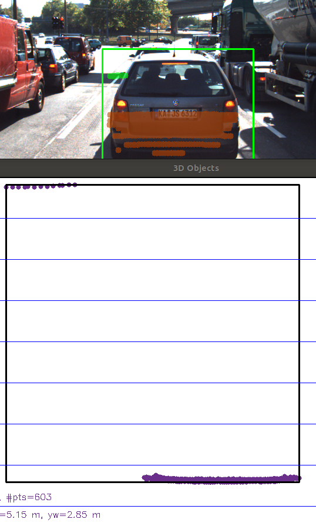  

### FP.5-2. Ground 
Depending on the size of the bounding box and the height threshold of the filter that crops LiDAR points, LiDAR points reflected from the road (ground) could be considered as a part of the preceding vehicle.
The case of the hill, the distance between the LiDAR and the ground is not constant.  
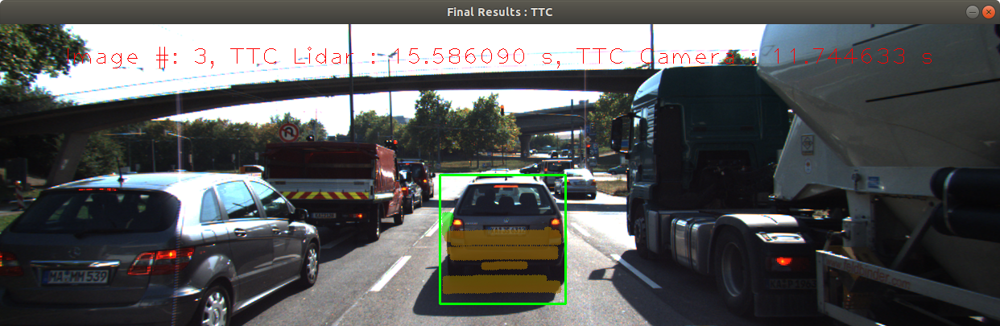  
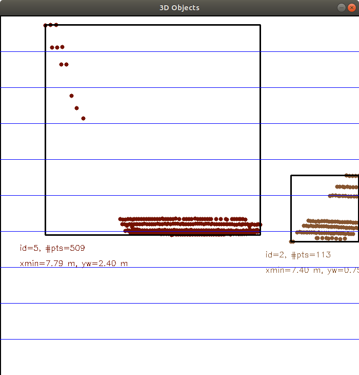  

### FP.5-3. Other bounding box
Lidar points on the preceding vehicle can be considered as a part of the truck on the right lane.
  
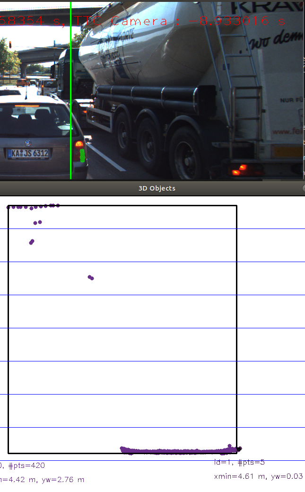  

--------------
# FP.6 : Performance Evaluation 2

Looking at the following table and the graph, SIFT-SIFT is the closest graph to the LiDAR TTC graph. 
However, BRIEF descriptor is much more faster than SIFT descriptor. 
So, I took the **SIFT-BRIE** as the best detector / descriptor combinations.
Ave.(diff) = AVERAGE( (lidar tcc - )^2 ) from image 1 to image 50.  
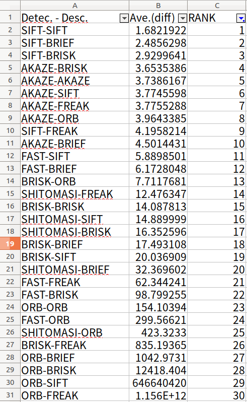  

  
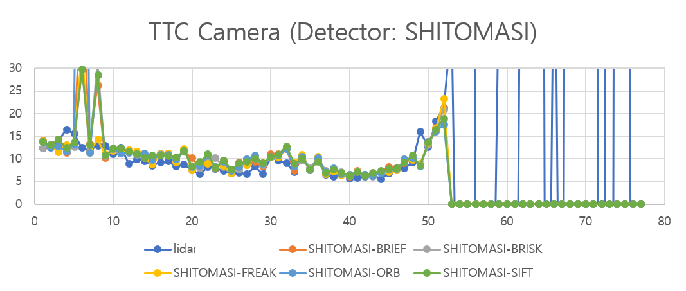  
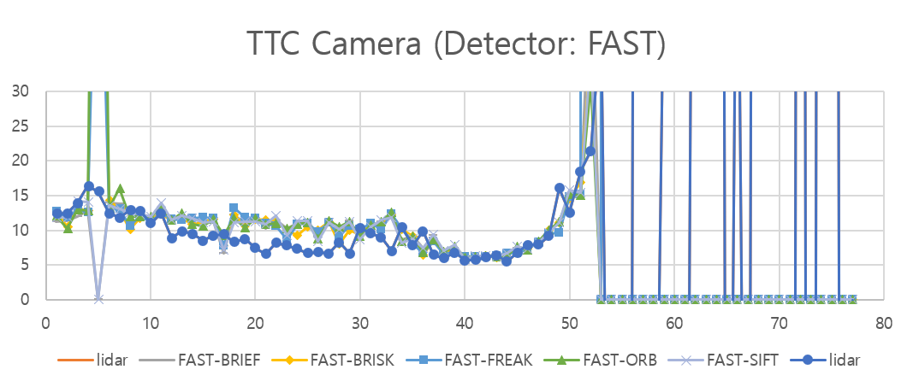  
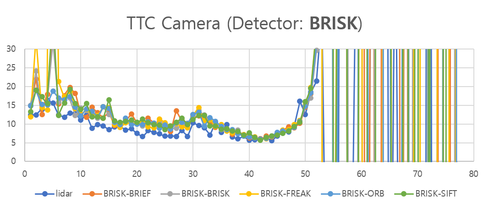  
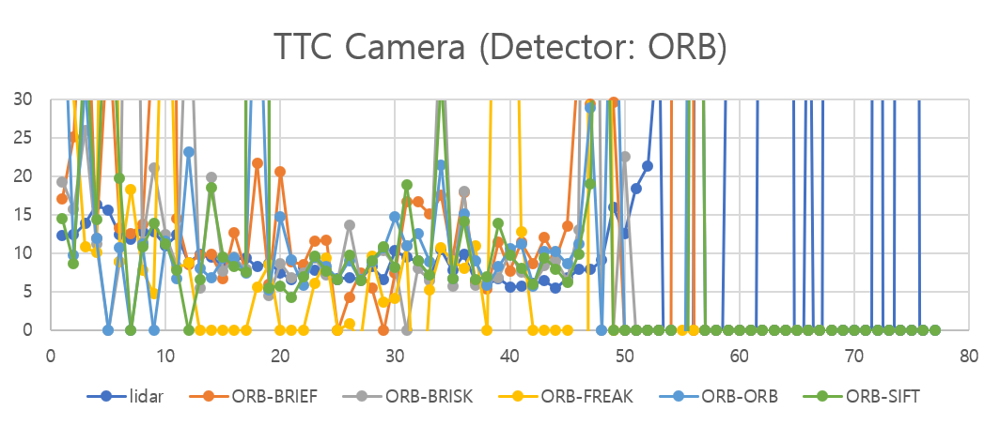  
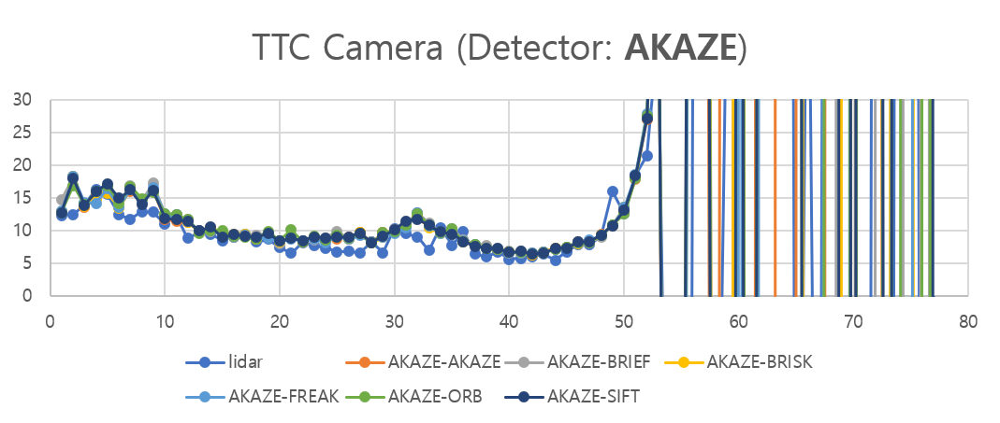  
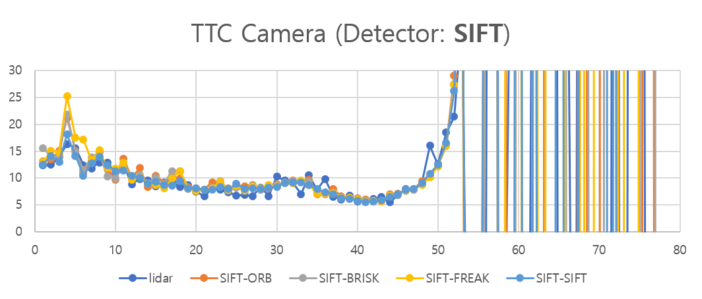  
SIFT-ORB(X)->SIFT-BRIEF 

<!-- ### SHITOMASI
In the 5th image, the median distance ratio (dist curr / dist prev)   
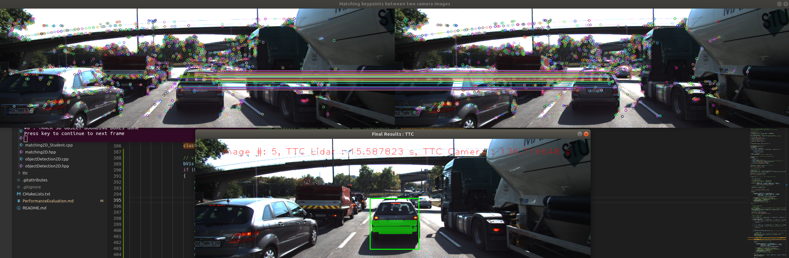  
-->